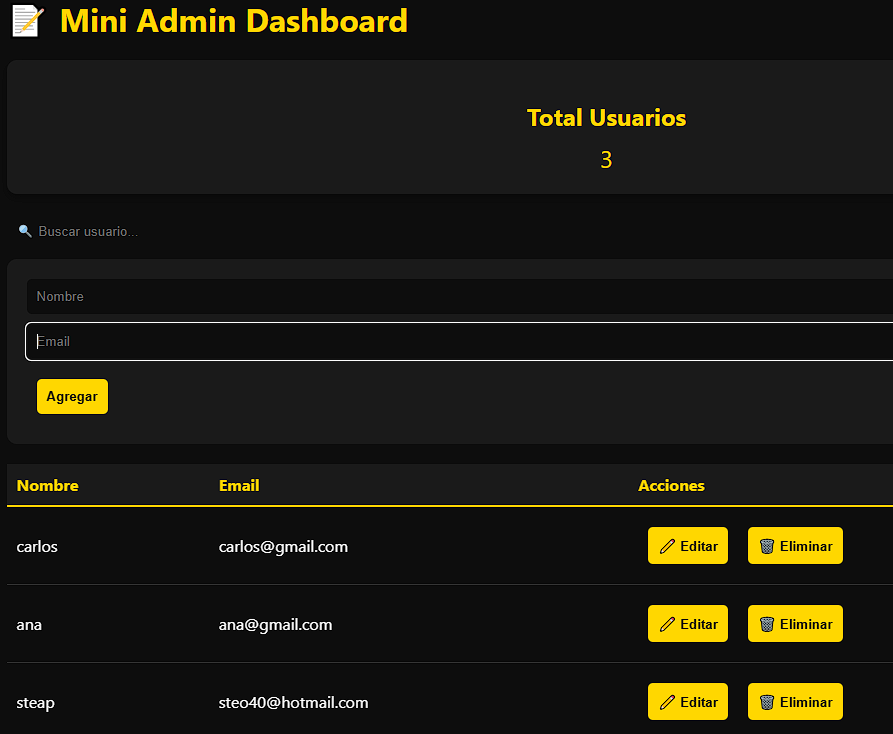

# 🧩 Mini Admin Dashboard

Un **dashboard administrativo full stack** desarrollado con **React**, **Express** y **SQLite**, que permite gestionar usuarios (crear, listar, editar y eliminar) desde una interfaz sencilla.

---

## 🚀 Tecnologías Utilizadas

### 🖥️ Frontend
- **React.js** — interfaz dinámica y modular  
- **Fetch API / Axios** — comunicación con el backend  
- **CSS personalizado** — tema oscuro  

### ⚙️ Backend
- **Node.js** + **Express.js** — servidor RESTful  
- **CORS** — habilitado para comunicación entre frontend y backend  
- **SQLite** — base de datos ligera y persistente  

---

## 🧠 Funcionalidades

- 📋 Visualización de usuarios en tabla dinámica  
- ➕ Agregar nuevos usuarios (nombre + email)  
- ✏️ Editar usuarios existentes  
- ❌ Eliminar usuarios  
- 🔍 Buscar usuarios por nombre o email  
- 🔢 Contador automático del total de usuarios  
- 🎨 Diseño responsive con tema oscuro y acento amarillo (#FFD700)

---

## 🗂️ Estructura del Proyecto

```
mini-admin-dashboard/
│
├── backend/
│   ├── server.js            # Servidor Express
│   ├── db.js                # Configuración de SQLite
│   └── package.json
│
├── frontend/
│   ├── src/
│   │   ├── App.js           # Lógica principal del dashboard
│   │   ├── App.css          # Estilos del dashboard
│   │   ├── components/      # Componentes (Formulario, Tabla, etc.)
│   │   └── index.js
│   ├── public/
│   │   └── index.html
│   └── package.json
│
└── README.md
```

---


## 🧱 API Endpoints

| Método | Endpoint | Descripción |
|--------|-----------|--------------|
| **GET** | `/api/users` | Obtiene todos los usuarios |
| **POST** | `/api/users` | Crea un nuevo usuario |
| **PUT** | `/api/users/:id` | Actualiza un usuario existente |
| **DELETE** | `/api/users/:id` | Elimina un usuario |

---

## 💾 Base de Datos (SQLite)

El archivo de base de datos se crea automáticamente si no existe, y contiene una tabla `users` con las siguientes columnas:

| Campo | Tipo |
|-------|------|
| id | INTEGER (PK, autoincrement) |
| name | TEXT |
| email | TEXT |

---

## ✨ Vista del Proyecto

Ejemplo del dashboard en funcionamiento:



> Muestra total de usuarios, formulario de alta, buscador, tabla y botones de acción con estilo amarillo y fondo negro.

---

## 👨‍💻 Autor

**Mini Admin Dashboard**  
Desarrollado  *SHS*  
Stack: React + Node.js + Express + SQLite  

---

> 🖤 Proyecto full stack funcional, modular y escalable.
